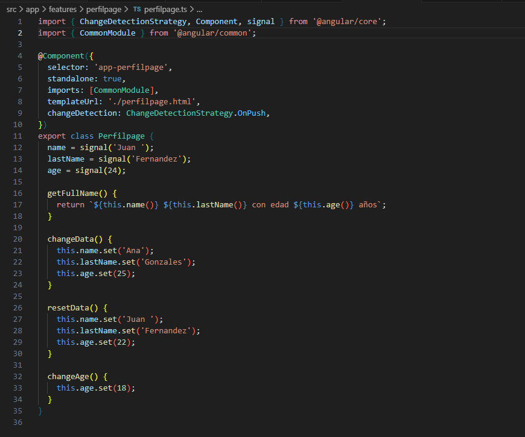
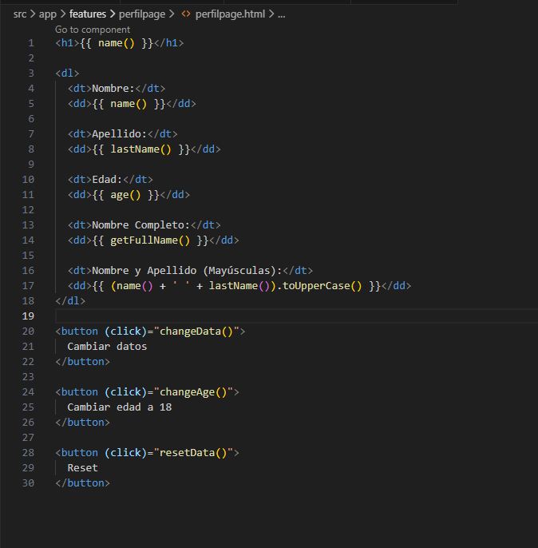
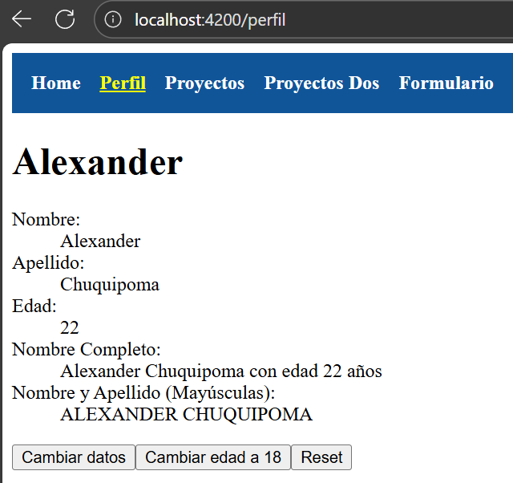

# Programación y Plataformas Web 

# Frameworks Web: Angular

<div align="center">
  

</div>


## Practica 2: Fundamentos 

### Autores
**Alexander Chuquipoma**  
📧 [achuquipoma@est.ups.edu.ec](mailto:achuquipoma@est.ups.edu.ec)  
💻 GitHub: [AlexChuquipoma](https://github.com/AlexChuquipoma)

**Juan Fernandez**  
📧 jfernandezl6@est.ups.edu.ec  
💻 GitHub: [Juan0Fernandedez](https://github.com/Juan0Fernandez)

## Fudamentos de Angular

## ¿Qué es Angular?

Angular es un framework de desarrollo web de código abierto mantenido por Google. Está diseñado para crear aplicaciones web dinámicas y de una sola página (SPA) utilizando TypeScript como lenguaje principal. Angular proporciona una estructura robusta y herramientas integradas para facilitar el desarrollo, la prueba y el mantenimiento de aplicaciones web complejas.

## Características principales de Angular

1. **Componentes**: Angular utiliza una arquitectura basada en componentes, donde cada componente representa una parte reutilizable de la interfaz de usuario con su propia lógica y estilo.

2. **Data Binding**: Angular ofrece un sistema de enlace de datos bidireccional que sincroniza automáticamente los datos entre el modelo y la vista, facilitando la actualización de la interfaz de usuario.

3. **Directivas**: Las directivas son atributos especiales que permiten manipular el DOM de manera declarativa, facilitando la creación de comportamientos personalizados en los elementos HTML.

4. **Inyección de Dependencias**: Angular tiene un sistema de inyección de dependencias que facilita la gestión y reutilización de servicios y componentes en toda la aplicación.

5. **Ruteo**: Angular incluye un sistema de enrutamiento que permite la navegación entre diferentes vistas y componentes dentro de una aplicación de una sola página.

6. **Herramientas de Desarrollo**: Angular CLI (Command Line Interface) es una herramienta poderosa que facilita la creación, construcción y mantenimiento de proyectos Angular.

## Rutas

Angular utiliza un sistema de enrutamiento para gestionar la navegación entre diferentes vistas y componentes. Las rutas se definen en el módulo de enrutamiento de la aplicación y permiten cargar componentes específicos en función de la URL solicitada.


## Directivas

Las directivas en Angular son atributos o elementos especiales que permiten manipular el DOM de manera declarativa. Existen tres tipos principales de directivas:

## Servicios
Los servicios en Angular son clases que proporcionan funcionalidades específicas y se utilizan para compartir datos y lógica entre diferentes componentes. Los servicios se inyectan en los componentes mediante el sistema de inyección de dependencias de Angular.

## Pipes

Los pipes en Angular son funciones que transforman los datos antes de mostrarlos en la vista. Se utilizan para formatear, filtrar o transformar valores en plantillas HTML de manera sencilla y reutilizable.

* Modificar el texto a mayúsculas:
```html
{{ 'texto de ejemplo' | uppercase }}
```
 * Ordena y filtra:
```html
<li *ngFor="let item of items | orderBy: 'name' | filter: 'active'">
  {{ item.name }}
</li>
```

## Componentes de Angular

Los componentes son la piedra angular de cualquier aplicación Angular. Cada componente consta de tres partes principales:

1. **Clase del Componente**: Define la lógica y el comportamiento del componente utilizando TypeScript.

2. **Plantilla HTML**: Define la estructura y el diseño de la interfaz de usuario del componente.

3. **Estilos CSS**: Define la apariencia visual del componente, peude ser SCSS o cualquier otro preprocesador compatible.


## Resultados

### Creación de un Componente

Uso el comando `ng generate component` para crear un nuevo componente en Angular. Este comando genera automáticamente los archivos necesarios y actualiza el módulo correspondiente.

Componentes generados: HomePage, el cual le coloco en la carpeta `src/app/home/pages/homePage`.


**Descripción de la Imagen:** Esta captura muestra la estructura de archivos generada por Angular CLI para el nuevo componente `HomePage`, ubicado dentro de la carpeta `src/app/home/pages`.

### Resolución de la Tarea

Para la resolución de la tarea, se han implementado las siguientes configuraciones y archivos, siguiendo las instrucciones del GIST: [GIST](https://gist.github.com/PabloT18/f15f92224806731541d48027df336497)

1.  **Captura de `app.routes.ts`**
    
    
    **Descripción de la Imagen:** Este fragmento de código muestra la configuración del archivo `app.routes.ts`, donde se define el enrutamiento principal de la aplicación. Aquí se establecen las rutas para `Homepage`, `Perfilpage`, `ProyectosPage`, `ProyectoDosPage` y `FormularioPage`, asociando cada path a su componente correspondiente.

2.  **Captura de `perfilPage.ts`**
    
    
    **Descripción de la Imagen:** Este archivo (`perfilPage.ts`) define la lógica y el estado del componente `Perfilpage`. Utiliza **`signals`** para manejar las propiedades reactivas `name`, `lastName` y `age`, e incluye métodos como `getFullName()`, `changeData()`, `resetData()` y `changeAge()` para manipular el estado del perfil.

3.  **Captura de `perfilPage.html`**
    
    
    **Descripción de la Imagen:** Esta captura muestra la plantilla HTML (`perfilPage.html`) del componente `Perfilpage`. Se visualizan los datos del perfil (`name`, `lastName`, `age`) usando *data binding* unidireccional y bidireccional, y se incluyen botones con eventos **`(click)`** para interactuar con la lógica del componente, como cambiar datos o resetear el perfil.

4.  **Captura de la Página Desplegada**

    

    **Descripción de la Imagen:** Esta captura muestra la interfaz de usuario final del componente `Perfilpage` tal como se visualiza en el navegador web después de ser desplegado. Se puede observar la **renderización de los datos del perfil** y los botones interactivos en acción.

5.  **Enlace a la página de GitHub Pages**
    * [Enlace GitHub Pages](https://alexchuquipoma.github.io/icc-ppw-u2-01Fundamentos/)

6.  **Enlace al repositorio de GitHub del proyecto.**
    * [Enlace del Repositorio](https://github.com/AlexChuquipoma/icc-ppw-u2-01Fundamentos.git)

Paso 5 y 6 deben estar subidos al AVAC.

