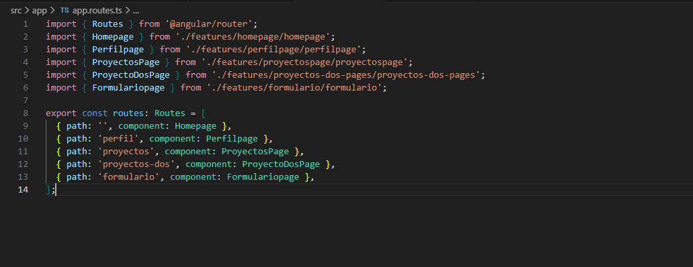
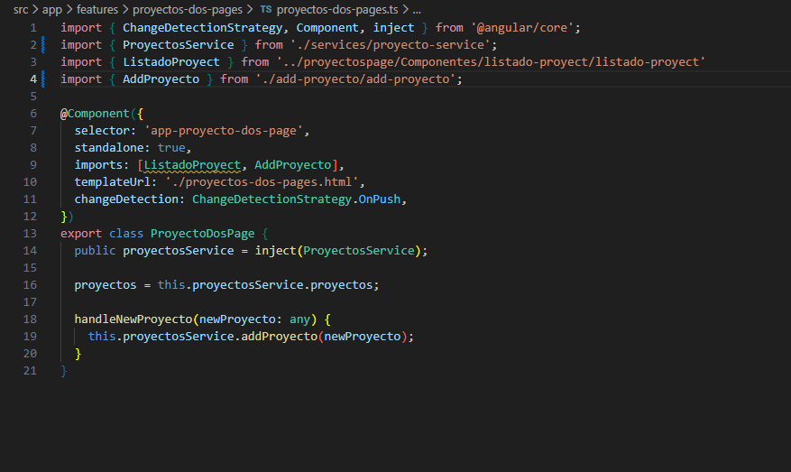
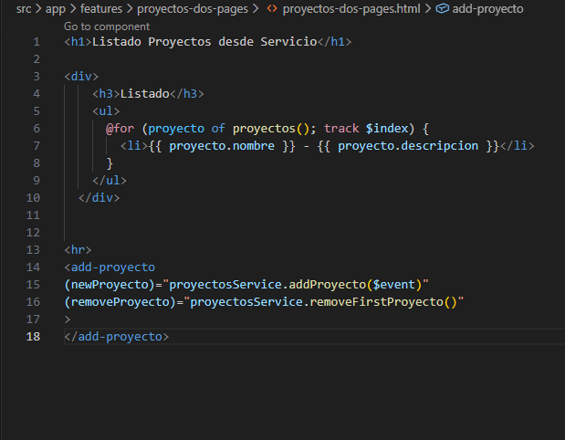
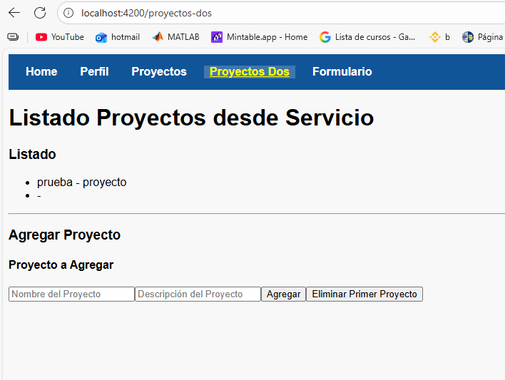

# Programación y Plataformas Web 

# Frameworks Web: Angular

<div align="center">
  
</div>

## Práctica 3: Navegación en Angular

### Autores
**Alexander Chuquipoma**  
📧 [achuquipoma@est.ups.edu.ec](mailto:achuquipoma@est.ups.edu.ec)  
💻 GitHub: [AlexChuquipoma](https://github.com/AlexChuquipoma)

**Juan Fernandez**  
📧 jfernandezl6@est.ups.edu.ec  
💻 GitHub: [Juan0Fernandedez](https://github.com/Juan0Fernandez)


## 🧭 Navegación en Angular

La navegación en Angular es fundamentalmente diferente a la navegación tradicional en HTML. Mientras que en HTML usamos etiquetas `<a href="">`, en Angular utilizamos la directiva `routerLink` para crear aplicaciones de una sola página (SPA) que no requieren recargar la página completa.

## 🔄 ¿Por qué NO usar `href` tradicional?

### ❌ Navegación Tradicional con `href`:
```html
<!-- Esto RECARGA toda la página -->
<a href="/perfil">Ir al Perfil</a>
<a href="/productos">Ver Productos</a>
```

**Problemas:**
- ✗ Recarga completa de la página
- ✗ Pérdida del estado de la aplicación
- ✗ Mayor tiempo de carga
- ✗ Experiencia de usuario interrumpida

### ✅ Navegación con `routerLink`:
```html
<!-- Esto SOLO cambia el contenido, sin recargar -->
<a routerLink="/perfil">Ir al Perfil</a>
<a routerLink="/productos">Ver Productos</a>
```

**Ventajas:**
- ✓ Navegación instantánea
- ✓ Preserva el estado de la aplicación
- ✓ Mejor experiencia de usuario
- ✓ Aplicación de una sola página (SPA)

## 📚 ¿Qué son las Directivas?

Las **directivas** son instrucciones especiales que le dicen a Angular cómo modificar el DOM (Document Object Model). En Angular existen tres tipos:

### 1. **Directivas de Componente**
```typescript
@Component({
  selector: 'app-home'  // Esta es una directiva de componente
})
```

### 2. **Directivas Estructurales** (Angular 20+)
```html
<!-- Control Flow moderno -->
@if (usuario) {
  <p>Bienvenido {{ usuario.nombre }}</p>
}

@for (producto of productos; track producto.id) {
  <div>{{ producto.nombre }}</div>
}
```

### 3. **Directivas de Atributo**
```html
<!-- routerLink es una directiva de atributo -->
<a routerLink="/inicio">Inicio</a>
<div [ngClass]="{'activo': isActive}">Contenido</div>
```

## 🔗 RouterLink: Tipos de Sintaxis

Angular ofrece dos formas principales de usar `routerLink`:

### 1. **Sintaxis de String Simple**
```html
<a routerLink="/">Home</a>
<a routerLink="/productos">Productos</a>
<a routerLink="/contacto">Contacto</a>
```

**Características:**
- ✓ Sintaxis más simple
- ✓ Ideal para rutas estáticas
- ✓ Fácil de leer y escribir

### 2. **Sintaxis de Array (Binding)**
```html
<a [routerLink]="['/perfil']">Perfil</a>
<a [routerLink]="['/usuario', usuarioId]">Ver Usuario</a>
<a [routerLink]="['/productos', 'categoria', categoriaId]">Categoría</a>
```

**Características:**
- ✓ Permite pasar parámetros dinámicos
- ✓ Más flexible para rutas complejas
- ✓ Ideal para rutas con variables

## 💡 Ejemplos Prácticos

### Ejemplo 1: Navegación Básica
```typescript
// app.component.ts
import { Component } from '@angular/core';
import { RouterModule } from '@angular/router';
import { CommonModule } from '@angular/common';

@Component({
  selector: 'app-root',
  standalone: true,
  imports: [RouterModule, CommonModule],
  template: `
    <nav>
      <h2>Mi Aplicación Angular</h2>
      <ul>
        <li><a routerLink="/">🏠 Inicio</a></li>
        <li><a routerLink="/productos">📦 Productos</a></li>
        <li><a routerLink="/contacto">📞 Contacto</a></li>
      </ul>
    </nav>
    
    <!-- Aquí se renderizan los componentes según la ruta -->
    <router-outlet></router-outlet>
  `,
  styles: [`
    nav {
      background: #f0f0f0;
      padding: 1rem;
      margin-bottom: 2rem;
    }
    
    ul {
      list-style: none;
      display: flex;
      gap: 1rem;
    }
    
    a {
      text-decoration: none;
      color: #007bff;
      padding: 0.5rem 1rem;
      border-radius: 4px;
    }
    
    a:hover {
      background: #e9ecef;
    }
  `]
})
export class AppComponent {
  title = 'navegacion-ejemplo';
}
```

### Ejemplo 2: Navegación con Parámetros
```typescript
// productos.component.ts
import { Component, signal } from '@angular/core';
import { RouterModule } from '@angular/router';
import { CommonModule } from '@angular/common';

@Component({
  selector: 'app-productos',
  standalone: true,
  imports: [RouterModule, CommonModule],
  template: `
    <h2>Lista de Productos</h2>
    
    @for (producto of productos(); track producto.id) {
      <div class="producto-card">
        <h3>{{ producto.nombre }}</h3>
        <p>{{ producto.descripcion }}</p>
        <p><strong>Precio: ${{ producto.precio }}</strong></p>
        
        <!-- Navegación con parámetros usando sintaxis de array -->
        <a [routerLink]="['/producto', producto.id]">
          👁️ Ver Detalles
        </a>
      </div>
    }
  `,
  styles: [`
    .producto-card {
      border: 1px solid #dee2e6;
      padding: 1rem;
      margin: 1rem 0;
      border-radius: 8px;
    }
    
    .producto-card a {
      background: #007bff;
      color: white;
      padding: 0.5rem 1rem;
      text-decoration: none;
      border-radius: 4px;
      display: inline-block;
      margin-top: 0.5rem;
    }
    
    .producto-card a:hover {
      background: #0056b3;
    }
  `]
})
export class ProductosComponent {
  productos = signal([
    { id: 1, nombre: 'Laptop', descripcion: 'Laptop Gaming', precio: 1200 },
    { id: 2, nombre: 'Mouse', descripcion: 'Mouse Inalámbrico', precio: 25 },
    { id: 3, nombre: 'Teclado', descripcion: 'Teclado Mecánico', precio: 80 }
  ]);
}
```

## 🎯 Diferencias Clave: String vs Array

| Aspecto | Sintaxis String | Sintaxis Array |
|---------|----------------|----------------|
| **Formato** | `routerLink="/ruta"` | `[routerLink]="['/ruta']"` |
| **Parámetros** | ❌ No soporta | ✅ `['/ruta', parametro]` |
| **Variables** | ❌ Solo texto fijo | ✅ Puede usar variables |
| **Complejidad** | Simple | Más flexible |

### Ejemplos Comparativos:

```html
<!-- ✅ String: Ideal para rutas fijas -->
<a routerLink="/">Inicio</a>
<a routerLink="/productos">Productos</a>
<a routerLink="/contacto">Contacto</a>

<!-- ✅ Array: Ideal para rutas dinámicas -->
<a [routerLink]="['/perfil']">Mi Perfil</a>
<a [routerLink]="['/usuario', usuario.id]">Ver Usuario: {{ usuario.nombre }}</a>
<a [routerLink]="['/producto', producto.id, 'reviews']">Reviews del Producto</a>

<!-- 🔍 Ejemplo con múltiples parámetros -->
<a [routerLink]="['/categoria', categoria.id, 'producto', producto.id]">
  Ver Producto en Categoría
</a>
```

## 🚀 RouterLink Activo

Para destacar el enlace activo, Angular proporciona `routerLinkActive`:

```html
<nav>
  <a routerLink="/" 
     routerLinkActive="active" 
     [routerLinkActiveOptions]="{exact: true}">
    Inicio
  </a>
  
  <a routerLink="/productos" 
     routerLinkActive="active">
    Productos
  </a>
  
  <a routerLink="/contacto" 
     routerLinkActive="active">
    Contacto
  </a>
</nav>

<style>
.active {
  background-color: #007bff;
  color: white;
  font-weight: bold;
}
</style>
```

## 📱 Navegación Programática

También podemos navegar desde el código TypeScript:

```typescript
import { Component, inject } from '@angular/core';
import { Router } from '@angular/router';

@Component({
  selector: 'app-ejemplo',
  template: `
    <button (click)="irAProductos()">Ver Productos</button>
    <button (click)="irAProducto(123)">Ver Producto 123</button>
  `
})
export class EjemploComponent {
  private router = inject(Router);
  
  irAProductos() {
    this.router.navigate(['/productos']);
  }
  
  irAProducto(id: number) {
    this.router.navigate(['/producto', id]);
  }
}
```


## 🎓 Resumen

1. **RouterLink** es una directiva de Angular que permite navegación SPA
2. **No usar `href`** porque recarga la página completa
3. **Sintaxis String**: Simple, para rutas fijas (`routerLink="/inicio"`)
4. **Sintaxis Array**: Flexible, para rutas con parámetros (`[routerLink]="['/perfil']"`)
5. **RouterLinkActive**: Para destacar enlaces activos
6. **Navegación programática**: Usando el servicio Router

La navegación en Angular es mucho más eficiente y proporciona una mejor experiencia de usuario comparada con la navegación tradicional HTML.

## 🛠️ Implementación Práctica

Sigue estos pasos para implementar la navegación en tu proyecto Angular:

### Paso 1: Crear las Páginas Principales
Se utilizó Angular Schematics (ng generate component) para crear los componentes de página principales, asegurando que fueran standalone: true.

1.1 Crear ProyectosPage: Componente definido como la vista principal para la ruta /proyectos.
1.2 Crear ProyectosDosPage: Componente diseñado como una vista compleja (contenedor) para la ruta /proyectos-dos, donde se integraría la lógica de estado y componentes modulares.

---

### Paso 2: Configurar las Rutas
Se modificó el archivo app.routes.ts para establecer el mapeo de las URLs de la aplicación.
* Se añadieron las rutas 'proyectos' y 'proyectos-dos', asociando cada una a su componente ProyectosPage y ProyectoDosPage, respectivamente.

---

### Paso 3: Agregar al Navbar
Se editó el template del componente de navegación para incluir los enlaces a las nuevas rutas.
* Se implementó la directiva routerLink para asegurar una navegación interna (SPA) sin recargar la página.
* Se aplicó la directiva routerLinkActive="active" para resaltar el enlace de la ruta activa del usuario.

---

### Paso 4: Crear Componentes para Proyectos y separarlos en componentes indivuduals
Se generaron componentes modulares reutilizables para descomponer la funcionalidad de gestión de proyectos.

4.1 Crear Componente para Agregar Proyectos (AddProyecto): Implementa la interfaz de usuario de entrada de datos. Se configuró con una propiedad @Output() para emitir los nuevos datos al componente contenedor.
4.2 Crear Componente para Lista de Proyectos (ListadoProyect): Componente enfocado en la visualización. Recibe la lista de proyectos mediante @Input() y utiliza el control flow @for para renderizar la lista.

---

### Paso 5: Implementar la Página de Proyectos
Se implementó el template y el typescript del componente ProyectosPage con el contenido y la lógica básicos asociados a la ruta /proyectos.

---

### Paso 6: Implementar la Página ProyectosDos
Se implementó la composición de la vista en ProyectoDosPage, demostrando la modularidad:
* En el archivo .ts, se utilizó inject() para obtener el servicio que maneja el estado de los proyectos.
* En la sección imports del componente, se incluyeron ListadoProyect y AddProyecto.
* En el template .html, se integraron los selectores <add-proyecto> y <app-listado-proyect>, enlazando sus propiedades y eventos a los métodos del servicio.

## �📸 Capturas de Implementación


**Descripción de la Imagen:** Este archivo es el mapa de la aplicación. Muestra cómo se han definido las **rutas estáticas** (`'perfil'`, `'proyectos'`) y cómo se asocian a sus componentes principales (`Perfilpage`, `ProyectoDosPage`), habilitando la navegación de una sola página (SPA).

---

### 2. Implementación del Contenedor (`proyectos-dos-pages.ts`)


**Descripción de la Imagen:** El corazón de la gestión de proyectos. Este componente:
1.  **Inyecta** (`inject(ProyectosService)`) el servicio que maneja el estado de la lista de proyectos.
2.  Define la propiedad `proyectos` que se conecta a los datos reactivos del servicio.
3.  **Importa** (`imports: [ListadoProyect, AddProyecto]`) los componentes hijos (`ListadoProyect` y `AddProyecto`), haciéndolos disponibles para ser usados en su plantilla.

---

### 3. Integración de Componentes (`proyectos-dos-pages.html`)


**Descripción de la Imagen:** Muestra la integración de los componentes hijos y la lógica de estado:
1.  La lista de proyectos se muestra mediante el *control flow* **`@for`** utilizando el arreglo de `proyectos()`.
2.  El componente **`<add-proyecto>`** se enlaza (`(newProyecto)`, `(removeProyecto)`) a los métodos del servicio (`addProyecto`, `removeFirstProyecto`), permitiendo que el componente hijo interactúe directamente con el estado global de la aplicación.

---

### 4. Aplicación Funcionando (Ruta: `/proyectos-dos`)


**Descripción de la Imagen:** Captura de la aplicación en el navegador en la ruta `/proyectos-dos`. Se observa la **barra de navegación** (donde el enlace "Proyectos Dos" está activo), el **listado de proyectos** (`prueba - proyecto`) y el formulario con los botones de **"Agregar"** y **"Eliminar"**, confirmando que la integración de los componentes y el servicio de estado funcionan correctamente.


## 🔗 Enlaces del Proyecto

- **Repositorio GitHub**: [[Enlace repositorio](https://github.com/AlexChuquipoma/icc-ppw-u2-01Fundamentos.git)]
- **GitHub Pages**: [[Enlace GitHub Pages](https://alexchuquipoma.github.io/icc-ppw-u2-01Fundamentos/)]


